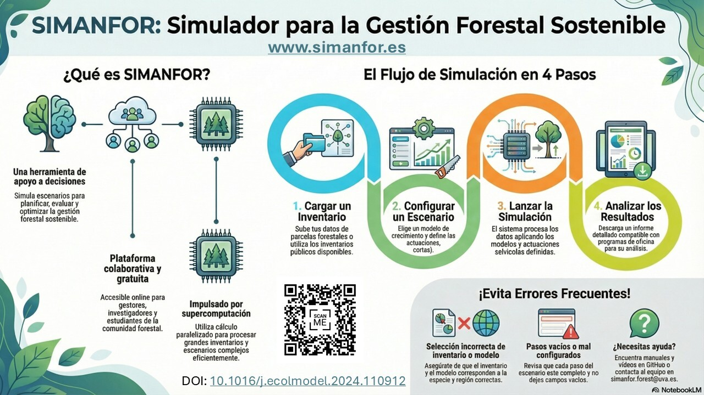

# Welcome to the SIMANFOR repository

---

🇬🇧 **You are viewing the content of the repository in English**

🇪🇸 *[Versión en español aquí](./README.md)*

---

### 🙋‍♀️ We are the Quantitative Forestry research group of the [iuFOR - University Institute on Sustainable Forest Management Research](https://iufor.uva.es/)

##### 🌳 SIMANFOR is a tool developed for our group. It is a Decision Support System for the Simulation of Sustainable Forest Management Alternatives available at his [website](https://www.simanfor.es/), which support information is available at [this repository](https://github.com/simanfor). Here, you will find:

* [Escenarios en SIMANFOR](https://github.com/simanfor/escenarios) - *SIMANFOR scenarios*: a repository with information related to the creation of silviculture itineraries
* [Introducción a SIMANFOR](https://github.com/simanfor/introduccion) - *Introduction to SIMANFOR*: a repository with information to understand how this tool works
* [Inventarios en SIMANFOR](https://github.com/simanfor/inventarios) - *SIMANFOR inventories*: a repository with information related to the development of forest inventories adapted to SIMANFOR and some examples
* [Manual de uso de SIMANFOR](https://github.com/simanfor/manual) - *SIMANFOR user's manual*: a repository with the user's manual of SIMANFOR (Spanish and English)
* [Modelos en SIMANFOR](https://github.com/simanfor/modelos) - *SIMANFOR models*: a repository with information related to SIMANFOR models and sheets describing the models already available on the simulator
* [Publicaciones acerca de SIMANFOR](https://github.com/simanfor/publicaciones) - *SIMANFOR publications*: a repository that shows the publications where this simulator was used
* [Resultados de simulación en SIMANFOR](https://github.com/simanfor/resultados) - *SIMANFOR results*: a repository with information related to SIMANFOR outputs and some examples
* [Web de SIMANFOR](https://github.com/simanfor/web) - *SIMANFOR website*: a repository with information about the SIMANFOR website and how it works

---

### 🎬 You also have available explanations in video format that will help you to better understand how SIMANFOR works and to take your first steps with this tool (just Spanish by the moment):

- 📜 Playlist: [SIMANFOR: Sistema de apoyo para la simulación de alternativas de manejo forestal sostenible](https://youtube.com/playlist?list=PLsdzTKpJZZa7vn5zGpn07-bd0Nce-fMhJ&feature=shared)
    - ▶️ [Introducción a SIMANFOR](https://youtu.be/Y8pWcPdHsMY?feature=shared)
    - ▶️ [Documentación de SIMANFOR en GitHub](https://youtu.be/i4AXBrm4PqI?feature=shared)
    - ▶️ [Primera toma de contacto con la web de SIMANFOR](https://youtu.be/SlfTKkf37MA?feature=shared)
    - ▶️ [Explorando inventarios para utilizar en SIMANFOR](https://youtu.be/_SOIN--Tllw?feature=shared)
    - ▶️ [Mi primera simulación en SIMANFOR](https://youtu.be/kCRNgIsfAn8?feature=shared)
    - ▶️ [Explorando los resultados de SIMANFOR](https://youtu.be/bfUqAEd2i94?feature=shared)
    - ▶️ [Visualizar resultados de SIMANFOR en R](https://youtu.be/a0Mo-WqyHbE?si=tb07ZZZoCx_hhl2A)
    - ▶️ [Simulaciones con modelos de árbol individual para masas puras en SIMANFOR](https://youtu.be/E06jUw3endo?si=sZuXwWM3iRCU3_Wx)
    - ▶️ [Simulaciones con modelos de árbol individual para masas mixtas en SIMANFOR](https://youtu.be/FW5giE_BKpM?si=OowzInCz6gGFjhxJ)
    - ▶️ [Simulaciones con modelos estáticos en SIMANFOR](https://youtu.be/b11iagnqRCA?si=_IIVvrP2mRoeq1oX)
    - ▶️ [Simulaciones con modelos de masa en SIMANFOR](https://youtu.be/JDY86hcv8dM?si=gZ8SlTi7cVV2H1b5)
    - ▶️ [Cómo aplicar cortas en SIMANFOR](https://youtu.be/jwO3t0itVuE?si=R04ldbn1RtHblJdy)
    - ▶️ [Simulaciones utilizando cortas por especies para masas mixtas en SIMANFOR](https://youtu.be/jNKvKxR7YvE?feature=shared)
    - ▶️ [Simulaciones utilizando cortas con árboles de futuro en SIMANFOR](https://youtu.be/dJvYjD4c0ss?feature=shared)
    - ▶️ [Escenarios en SIMANFOR: errores frecuentes y edición de escenarios](https://youtu.be/4tFygnCK2UU?si=1-cZ_r2ev1PDTTq8)
    - ▶️ [Aplicando un mismo escenario selvícola a parcelas de diferente edad en SIMANFOR](https://youtu.be/vH7HI3d5hPU?feature=shared)

---

### 🔗 Apart from that, we own other repositories that can be interesting for you:

- 📈 [SMART Ecosystems Research group](https://github.com/iuFOR-QuantitativeForestry) is the main repository of our research group, where you will find information related to many ongoing and finished projects
- ✨ [Chair SMART Global Ecosystems](https://github.com/SMART-Global-Ecosystems) is a Chair that we own joint with [Sngular](https://www.sngular.com/). More information [here](https://smartglobalecosystems.uva.es/)

---

### 💻 Lista de contribuidores / Contributors list

#### Felipe Bravo Oviedo:

 

 
 
 
 

#### Angel Cristóbal Ordóñez Alonso:

 

 
 
 
 

#### Aitor Vázquez Veloso:

 

#### Spyridon Michalakopoulos:

 

 
 
 
 

---

### 📧 Contact

*For any questions or suggestions, you can contact the SIMANFOR technical team at simanfor.forest@uva.es*.

---

## ℹ️ More information

For more SIMANFOR content, videos, publications and how to cite, visit:

* 🔗 [More information about SIMANFOR](https://github.com/simanfor/.github/blob/main/docs/more_info_english.md)

---

