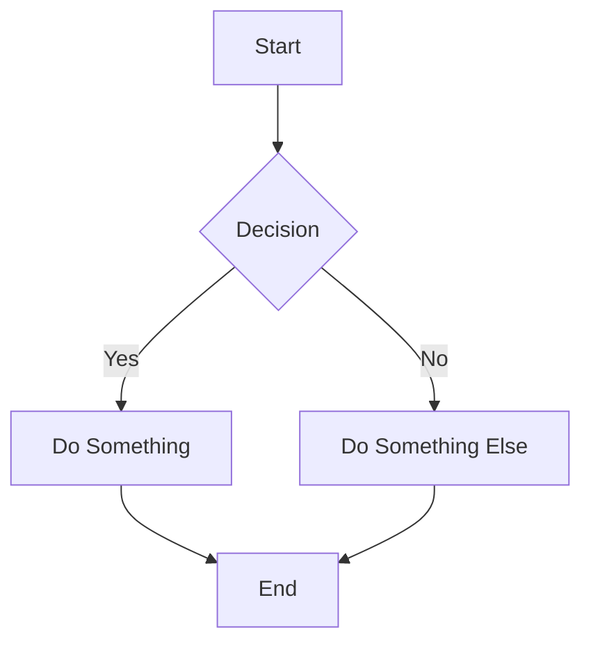
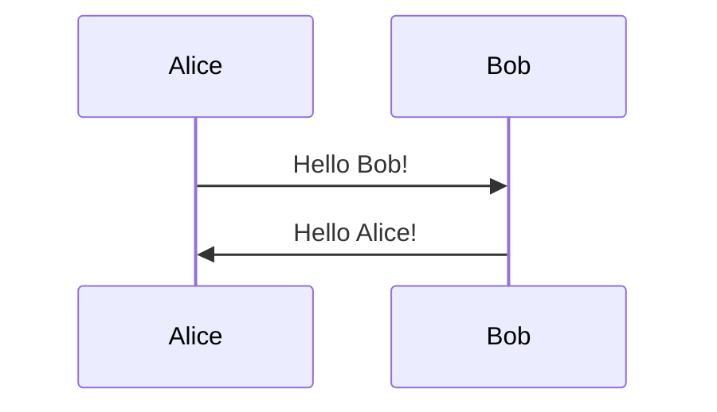

# Citation

The citation section appears in every `more_info` file. It contains a plain-text citation followed by a BibTeX code block.

---

## BibTeX block (more_info files only)

Include the BibTeX entry as a fenced code block with ` ```bibtex ` in the English version:

````markdown
```bibtex
@article{bravo_simanfor_2025,
	title = {{SIMANFOR} cloud {Decision} {Support} {System}: {Structure}, content, and applications},
	volume = {499},
	issn = {0304-3800},
	doi = {10.1016/j.ecolmodel.2024.110912},
	journal = {Ecological Modelling},
	author = {Bravo, F. and Ordóñez, C. and Vázquez-Veloso, A. and Michalakopoulos, S.},
	year = {2025},
	pages = {110912},
}
```
````

> The BibTeX block is placed between the plain-text citation and the note about citing individual models.

````markdown



`````
